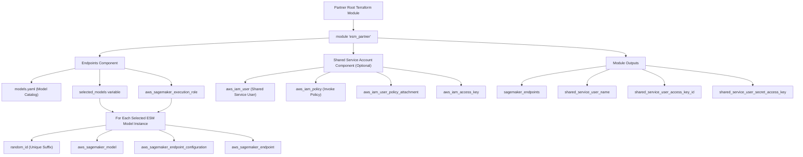
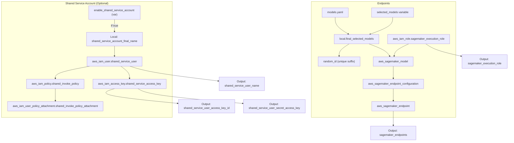

# terraform-aws-esm-partner

The **terraform-aws-esm-partner** module deploys SageMaker resources for EvolutionaryScale's ESM models in AWS. It creates the necessary IAM roles, SageMaker models, endpoint configurations, and endpoints using a configurable model catalog. The module also optionally provisions a shared service account for accessing the endpoints.

This module is designed to be used by enterprise partners to easily deploy and manage ESM models within their dedicated AWS environment using Infrastructure-as-Code (IaC).

## Features

- **Multi-Model Support:**  
  Use a `models.yaml` catalog to define available models and select which ones to deploy via a map variable (`selected_models`).

- **Customizable Deployments:**  
  Override instance types, counts, and naming conventions through input variables.

- **Unique Resource Identification:**  
  Resources are assigned unique suffixes (via a random_id) to avoid name collisions and ease management.

- **Optional Shared Service Account:**  
  When enabled, the module creates a shared IAM user (with an associated policy and access keys) to allow a shared service account to invoke SageMaker endpoints.

## Module Structure

### Tree

```
terraform-aws-esm-partner/
├── README.md                # This documentation file.
├── examples/                # Example usage configurations.
│   ├── basic/               # Example with one or more model endpoints.
│   ├── basic_shared_user/   # Example including a shared service account.
│   └── multi_model/         # Example demonstrating multi-model deployments.
├── main.tf                  # Main module configuration (SageMaker endpoints).
├── models.yaml              # Catalog of available models.
├── outputs.tf               # Module outputs.
├── shared_user_accounts.tf  # Resources for creating shared service accounts.
├── variables.tf             # Module input variables.
└── versions.tf              # Provider version requirements.
```

### High-Level Module Structure

This diagram shows the overall structure of the module as it’s used in your root configuration:



### Detailed Component Relationships

This diagram dives into how the endpoints and shared user account parts relate to each other within the module:



## Usage

Include this module in your Terraform configuration as follows:

```hcl
# Example Terraform configuration for deploying SageMaker models and endpoints using the ESM Partner module.

provider "aws" {
  region = "us-east-2"

  default_tags {
    tags = {
      Environment = "dev"
      Project     = "esm-partner"
    }
  }
}

module "esm_partner" {
  source ="git@github.com:evolutionaryscale/esm-partner.git//iac/terraform-aws-esm-partner?ref=v0.9.0"

  # Select the models to deploy. Each entry in the map corresponds to a
  # model deployment configuration. The key is a logical name for the
  # deployment, and the value is an object containing the model selector (and,
  # optionally, instance type and count). The selector must match a model
  # defined in the `models_menu` of the included models.yaml file. The
  # instance_type must match one of the instance types supported by the model.
  selected_models = {
    "prototype_model" = {
      selector       = "ESMC-300M"
      instance_type  = "ml.g5.2xlarge"
    }
  }
}

# Outputs for the deployed SageMaker models and endpoints. Values
# needed to access the ESM API include: endpoint_name, endpoint_url, 
# forge_model_name.
output "sagemaker_endpoints" {
  description = "Deployed SageMaker endpoints from the module."
  value       = module.esm_partner.sagemaker_endpoints
}
```

## Inputs

The module accepts the following key variables (see variables.tf):
- **selected_models (map(object)):**
  A map where each key is a logical name for a model deployment.

  The object should include:
    - selector (string): Must match a key in models.yaml.
    - instance_type (optional string): Override the default instance type for the model.
    - instance_count (optional number): Override the default instance count.

- **iam_role_name_prefix (string):**
  Prefix used for naming IAM roles and related resources.

- **environment (string):**
  Deployment environment (e.g., dev, staging, prod).

- **region (string):**
  AWS region to deploy the resources.

- **tags (map(string)):**
  Common tags to apply to all resources.

- **enable_shared_service_account (bool):**
  Set to true to create a shared IAM user for endpoint invocation.

- **shared_service_account_name (string, optional):**
  Optional override for the default shared service account name.

## Outputs

The module exports the following outputs:

- **sagemaker_endpoints (map(object)):**
  A map of deployed endpoint details (endpoint URL, configuration name, endpoint name, and forge model name).

- **sagemaker_execution_role (string):**
  The name of the IAM role used for SageMaker.

- **shared_service_user_name (string):**
  The name of the shared IAM user, if created (outputs an empty string if not enabled).

- **shared_service_user_access_key_id (string):**
  The user access key associated with the shared service user (outputs an empty string if not enabled).

- **shared_service_user_secret_access_key (string):**
  The secret key associated with the shared service user (sensitive, not outputs by default).

## License

Usage of this module is governed by your separate licensing agreement with EvolutionaryScale.

## Examples

See the examples in the examples/ directory:
- **Basic**: Deploy a simple model endpoint.
- **Basic Shared User**: Deploy a model endpoint with a shared service account.
- **Multi Model**: Deploy multiple model endpoints concurrently.

## Contributing

Contributions, improvements, and feedback are welcome. Please file a bug or reach out by email to contact us.
